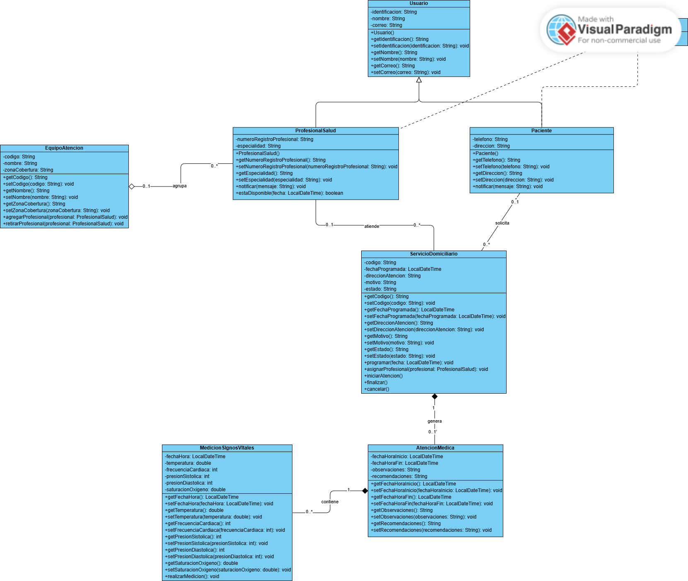

# MediHome

Proyecto universitario de **Diseño y Programación**. Modela en Java el caso MediHome: un paciente solicita un servicio de atención médica domiciliaria, un profesional de salud lo atiende y durante la visita se registran sus signos vitales. Al final el programa imprime un reporte de la atención.

## Participantes

- Jesús Alexander Guerrero
- Armando José Monterrosa

## Tecnologías

- Java
- Programación Orientada a Objetos
- Visual Paradigm

## Diagrama UML

El diagrama de clases se hizo en Visual Paradigm (versión en línea).

- Imagen: [`docs/diagrama-mediHome.png`](docs/diagrama-mediHome.png)
- Fuente: [`docs/diagrama-mediHome.puml`](docs/diagrama-mediHome.puml), el mismo diagrama en formato PlantUML con todas las clases, atributos, métodos, relaciones y multiplicidades. Se puede abrir y editar en [plantuml.com](https://www.plantuml.com/plantuml) o en VS Code.



## Clases

| Clase | Responsabilidad |
|---|---|
| `Usuario` | Clase base con identificación, nombre y correo. |
| `Notificable` | Interfaz con `notificar(mensaje)`. La realizan `ProfesionalSalud` y `Paciente` (líneas punteadas del diagrama). |
| `ProfesionalSalud` | Usuario con registro profesional y especialidad. Recibe notificaciones por correo y verifica su disponibilidad (`estaDisponible`). |
| `Paciente` | Usuario con teléfono y dirección. Recibe notificaciones por SMS. |
| `EquipoAtencion` | Agrupa profesionales por zona de cobertura (`agregarProfesional`, `retirarProfesional`). |
| `ServicioDomiciliario` | Visita solicitada por un paciente. Se programa, se le asigna un profesional y se inicia, finaliza o cancela. |
| `AtencionMedica` | Atención generada por el servicio, con observaciones, recomendaciones y mediciones. |
| `MedicionSignosVitales` | Temperatura, frecuencia cardíaca, presión arterial y saturación de oxígeno. |
| `Main` | Crea los objetos, los relaciona y muestra el reporte final. |

## Conceptos de POO

- **Encapsulamiento:** todos los atributos son `private` y se accede a ellos con getters y setters.
- **Herencia:** `ProfesionalSalud` y `Paciente` extienden `Usuario` y heredan identificación, nombre y correo.
- **Polimorfismo:** `Main` recorre un arreglo `Notificable[] { paciente, profesional }` y llama `notificar(...)`. Cada clase sobrescribe el método a su manera: el paciente recibe un SMS y el profesional un correo.
- **Asociaciones:** `ServicioDomiciliario` guarda al `Paciente` que lo solicita y al `ProfesionalSalud` que lo atiende.
- **Agregación:** `EquipoAtencion` agrupa profesionales que existen por fuera del equipo.
- **Composición:** `ServicioDomiciliario` crea su `AtencionMedica` en `iniciarAtencion()`, y la `AtencionMedica` contiene sus `MedicionSignosVitales`.

## Ejecución

Requiere JDK 17 o superior. Desde la raíz del proyecto:

```bash
javac -d out src/*.java
java -cp out Main
```
